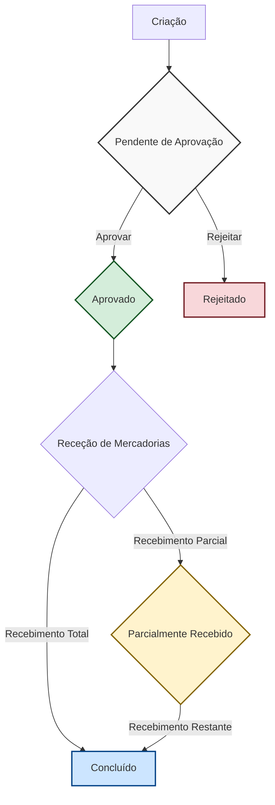

# Fluxo do Pedido de Compra

Este documento descreve o ciclo de vida de um Pedido de Compra (PC) no sistema, desde a sua criação até à sua conclusão.

## Visão Geral

O processo de pedido de compra é projetado para gerir a aquisição de produtos, sejam eles para revenda ou matérias-primas. O fluxo envolve várias etapas, incluindo criação, aprovação, receção de mercadorias e atualização de stock.

## Etapas do Fluxo

### 1. Criação do Pedido

- **Iniciação**: Um novo Pedido de Compra é criado por um utilizador com as devidas permissões.
- **Estado Inicial**: O pedido é criado com o estado **"Pendente de Aprovação" (`PENDING_APPROVAL`)**.
- **Preenchimento de Dados**:
    - **Fornecedor**: É selecionado um fornecedor principal para o pedido. Se nenhum for selecionado, o pedido é considerado do tipo "Marketplace", permitindo a especificação de fornecedores diferentes para cada item.
    - **Datas**: São definidas a "Data de Emissão" e a "Data Estimada de Entrega".
    - **Itens**: São adicionados os produtos ao pedido. Para cada item, são especificados:
        - O produto a ser comprado.
        - A quantidade.
        - O preço unitário de compra.
        - Um custo de frete específico para o item (opcional).
    - **Frete do Pedido**: Um custo de frete geral para todo o pedido pode ser adicionado.

### 2. Cálculo de Custos

O sistema calcula automaticamente os seguintes valores:
- **Subtotal do Item**: `Quantidade` x `Preço Unitário`.
- **Custo Total do Item**: O custo do item inclui o seu subtotal, o seu frete específico e uma porção do frete geral do pedido, distribuída proporcionalmente com base no subtotal do item.
- **Total do Pedido**: É a soma do subtotal de todos os itens, mais a soma de todos os fretes (tanto de itens individuais como o frete geral do pedido).

### 3. Aprovação ou Rejeição

- **Edição**: Enquanto o pedido está no estado "Pendente de Aprovação", ele pode ser editado e salvo.
- **Submissão para Aprovação**: Um utilizador com permissões de aprovação pode rever o pedido e tomar uma das seguintes ações:
    - **Aprovar**: O estado do pedido muda para **"Aprovado" (`APPROVED`)**. O pedido fica bloqueado para edição e está pronto para a próxima fase, que é a receção das mercadorias.
    - **Rejeitar**: O estado do pedido muda para **"Rejeitado" (`REJECTED`)**. O pedido é cancelado, fica bloqueado e não prossegue no fluxo.

### 4. Receção de Mercadorias

- Para pedidos **Aprovados**, a funcionalidade de "Receção de Mercadorias" fica disponível.
- Nesta etapa, o utilizador confirma a quantidade de cada produto que foi efetivamente entregue pelo fornecedor.
- A receção pode ser:
    - **Total**: Todas as quantidades pedidas foram entregues. O estado do pedido muda para **"Concluído" (`COMPLETED`)**.
    - **Parcial**: Apenas parte das quantidades foi entregue. O estado do pedido muda para **"Parcialmente Recebido" (`PARTIALLY_RECEIVED`)**.
- A confirmação da receção de mercadorias aciona a **atualização do stock** dos produtos recebidos.

## Diagrama de Estados do Pedido de Compra

