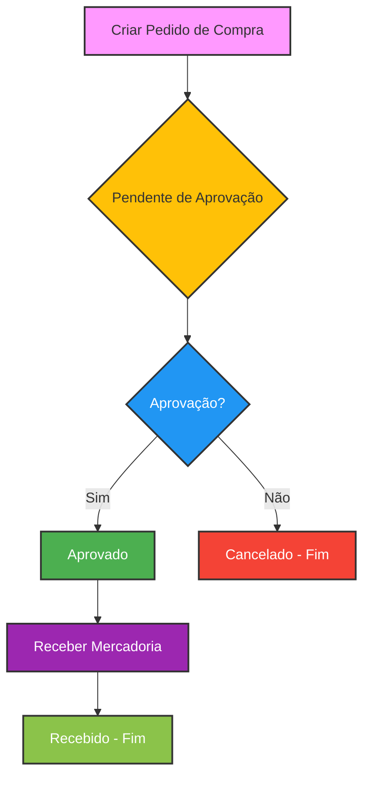

# Fluxo do Pedido de Compra

Este diagrama ilustra o ciclo de vida de um pedido de compra, desde a sua criação até à sua conclusão.

```mermaid
graph TD
    A[Criar Pedido de Compra] --> B{Pendente de Aprovação};
    B --> C{Aprovação?};
    C -- Sim --> D[Aprovado];
    C -- Não --> E[Cancelado - Fim];
    D --> F[Receber Mercadoria];
    F --> G[Recebido - Fim];

    style A fill:#f9f,stroke:#333,stroke-width:2px
    style B fill:#ffc107,stroke:#333,stroke-width:2px
    style C fill:#2196f3,stroke:#333,stroke-width:2px,color:white
    style D fill:#4caf50,stroke:#333,stroke-width:2px,color:white
    style E fill:#f44336,stroke:#333,stroke-width:2px,color:white
    style F fill:#9c27b0,stroke:#333,stroke-width:2px,color:white
    style G fill:#8bc34a,stroke:#333,stroke-width:2px,color:white
``` 